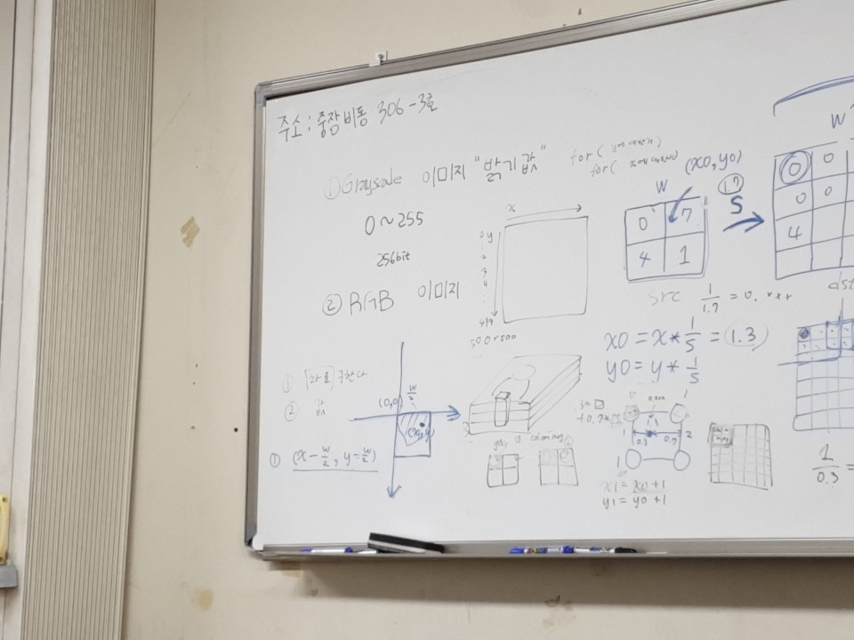
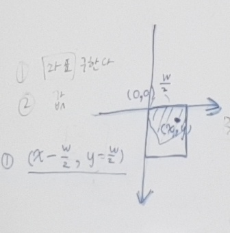

# Review

	-date: 2019.01.08(Tue) 14:00~17:00
	-location:건국대학교 중장비동 부트방

## 수업 목표

	opencv를 이용하여 영상처리를 배운다

### 수업 시 준비사항

	비주얼스튜디오에서 opencv에 적합하게 설정을 한다
[참고자료](https://webnautes.tistory.com/1132)

#### 수업 내용
	1.기본적인 것
		#include <opencv2/highgui.hpp>와
		#include <opencv2/imgproc.hpp>는 반드시 포함하기

		using namespace cv;

		Mat : 이미지를 저장할 클래스 (클래스: 나머지 다른거 다 선언 가능)

		imread: 이미지를 불러오는 함수
		imshow: 이미지를 띄워서 보기 위한 함수( 2개를 띄우기 위해서는 창 이름 2개 필요)
		imwrite: 이미지를 저장하는 함수
		WaitKey(): 괄호 안의 초동안 기다려라

		Height: img.rows;
		Width: img.cols;

		새로운 Mat object 생성
			Mat result(height,width,cv_8UC1); //for gray-scale, one channel, unsigned char
				8UC1: 데이터타입 8byte의 unsigned.
			Mat colors(height,width,cv_8UC3); //for color, 3 channel, unsigned char

		Mar의 모든 pixel 값을 특정 값으로 설정
			Mat img = Mat::zeros(height, width, CV_32FC1); // one channel, float
				Mat zeroe/ones: 안들어가면 쓰레기 값이 들어가게 된다.
			Mat img = Mat::ones(height, width, CV_64FC3); // 3 channel, double
			Mat img(height, width, CV_8UC1); // img = scalar(39);	

		순서는 항상 BGR!!

		흑백:0, 컬러:1
		R:0~255, G:0~255, B:0~255 (256bit)

		Image pixel 접근 방법: 
			color- rVal = imgcolor.at<Vec3b>(y,x)[2];
				   gVal = imgcolor.at<Vec3b>(y,x)[1];
				   bVal = imgcolor.at<Vec3b>(y,x)[0];
			grayscale - int grayVal;
						grayVal = imgGray.at<Uchar>(y,x);	   

		그레이 스케일의 경우- uchar 사용하기/ vec3b는 uchar의 단위

	2. 사진 띄우기
		#include <opencv2/opencv.hpp>
		#include <opencv2/highgui.hpp>
		#include <opencv2/imgproc.hpp>
		#include <iostream>
		#include <stdio.h>

		using namespace cv;
		using namespace std;

		int main(int, char**)
		{
			Mat img = imread("cv1.jpg", 1);
			imshow("image", img);
			imwrite("img.bmp", img);
			waitKey(0);
		}

		이 때 사진은 opencv cln이 위치한 곳의 하위 폴더에 넣어져 있어야 한다.	

	3. 흑백으로 바꾸기
		#include <opencv2/opencv.hpp>
		#include <opencv2/highgui.hpp>
		#include <opencv2/imgproc.hpp>
		#include <iostream>
		#include <stdio.h>

		using namespace cv;
		using namespace std;

		int main(int, char**)
		{
			Mat img = imread("cv1.jpg", 1);
			int height = img.rows;
			int width = img.cols;
			Mat grayimg(height, width, CV_8UC1);
			cvtColor(img, grayimg, COLOR_BGR2GRAY);
			imshow("Original image", img);
			imshow("Gray img", grayimg);
			waitKey(0);
		}

	4. 흑백 변환하기	

		순서
			-이미지를 불러온다.
			-이미지와 동일한 크기의 흑백 채널 매트 설정
			-이중 for문을 돌면서 수식(Gray=R+G+B/3)대로 계산해서 픽셀 값을 원소마다 채워 넣는다.

		#include <opencv2/imgproc.hpp>
		#include <opencv2/highgui.hpp>
		#include <iostream>

		using namespace cv;
		using namespace std;

		void main() {
   		// Read color image
  		Mat colorImg = imread("lena.jpg", 1);
   		int height = colorImg.rows;
   		int width = colorImg.cols;

   		// Convert to gray image
   		Mat grayImg(height, width, CV_8UC1);
   		for (int y = 0; y < height; y++) {
     		 for (int x = 0; x < width; x++) {
        		int b = colorImg.at<Vec3b>(y, x)[0];
         		int g = colorImg.at<Vec3b>(y, x)[1];
         		int r = colorImg.at<Vec3b>(y, x)[2];
         		int gray = (b + g + r) / 3;
         		grayImg.at<uchar>(y, x) = gray;
     		 }
  		 }
	
	5. Image Resizing (backward filling)
		img resize위해서는 interpolation 필요

		resize에서의 예외처리
			큰 곳에서 작은 곳으로 한 것
			맨 오른쪽 변, 맨 아래 변은 죽어버리게 된다.
			그러므로 예외처리는 가까운 지점에서 계산을 해주면 된다.
		

		가장자리에서 계산하지 않고 검은 공백으로 남기는 경우
			#include <opencv2/imgproc.hpp>
			#include <opencv2/highgui.hpp>
			#include <iostream>

			using namespace cv;
			using namespace std;

			int main() {
				// Read image
				Mat imgOrig = imread("lena.jpg", 0);
				int hOrig = imgOrig.rows;
				int wOrig = imgOrig.cols;
				cout << "Original image height : " << hOrig << endl;
				cout << "Original image width : " << wOrig << endl;

				// Get scale factor
				float scale;
				cout << "Input scale factor : ";
				cin >> scale;
				int hResult = imgOrig.rows*scale;
				int wResult = imgOrig.cols*scale;
				Mat imgResult = Mat::zeros(hResult, wResult, CV_8UC1);
				cout << "Result image height : " << hResult << endl;
				cout << "Result image width : " << wResult << endl;

				for (int y = 0; y < hResult; y++) {
					for (int x = 0; x < wResult; x++) {
						// (y0, x0)       ^     (y0, x1)
						//                |
						//               wy
						//                |
						// <-----wx----->(-)
						//
						// (y1, x0)             (y1, x1)

						// Find a position
						int x0 = x / scale;	// x0 pos at original image
						int y0 = y / scale;	// y0 pos at original image
						float wx = x / scale - x0;	// weight in x axis
						float wy = y / scale - y0;	// weight in y axis
						int x1 = x0 + 1;
						int y1 = y0 + 1;

						if (x1 >= 0 && x1 < wOrig && y1 >= 0 && y1 < hOrig) {
							// Get pixel values
							uchar p1 = imgOrig.at<uchar>(y0, x0);
							uchar p2 = imgOrig.at<uchar>(y0, x1);
							uchar p3 = imgOrig.at<uchar>(y1, x0);
							uchar p4 = imgOrig.at<uchar>(y1, x1);
							// Calculate new value
							float tVal = (1 - wx)*p1 + wx * p2;
							float bVal = (1 - wx)*p3 + wx * p4;
							float lVal = (1 - wy)*p1 + wy * p3;
							float rVal = (1 - wy)*p2 + wy * p4;
							uchar Val = ((1 - wx)*lVal + wx * rVal + (1 - wy)*tVal + wy * bVal) / 2;
							imgResult.at<uchar>(y, x) = Val;
						}
					}
				}

				// Show results
				imwrite("img_resize.bmp", imgResult);
				imshow("original", imgOrig);
				imshow("scaled", imgResult);
				waitKey(0);

				return 0;
			}	
		가장자리에서 가장 가까운 픽셀값을 가져와 계산하는 경우
			#include <opencv2/imgproc.hpp>	
			#include <opencv2/highgui.hpp>
			#include <iostream>

			using namespace cv;
			using namespace std;

			int main() {
				// Read image
				Mat imgOrig = imread("lena.jpg", 0);
				int hOrig = imgOrig.rows;
				int wOrig = imgOrig.cols;
				cout << "Original image height : " << hOrig << endl;
				cout << "Original image width : " << wOrig << endl;

				// Get scale factor
				float scale;
				cout << "Input scale factor : ";
				cin >> scale;
				int hResult = imgOrig.rows*scale;
				int wResult = imgOrig.cols*scale;
				Mat imgResult = Mat::zeros(hResult, wResult, CV_8UC1);
				cout << "Result image height : " << hResult << endl;
				cout << "Result image width : " << wResult << endl;

				for (int y = 0; y < hResult; y++) {
					for (int x = 0; x < wResult; x++) {
						// (y0, x0)       ^     (y0, x1)
						//                |
						//               wy
						//                |
						// <-----wx----->(-)
						//
						// (y1, x0)             (y1, x1)

				int x0 = x / scale;	// x0 pos at original image
				int y0 = y / scale;	// y0 pos at original image
				float wx = x / scale - x0;	// weight in x axis
				float wy = y / scale - y0;	// weight in y axis	

				int x1 = (x0 < wOrig - 1) ? x0 + 1 : x0;	// condition : x1 < width
				int y1 = (y0 < hOrig - 1) ? y0 + 1 : y0;	// condition : y1 < height

				// Get pixel values
				uchar p1 = imgOrig.at<uchar>(y0, x0);
				uchar p2 = imgOrig.at<uchar>(y0, x1);
				uchar p3 = imgOrig.at<uchar>(y1, x0);
				uchar p4 = imgOrig.at<uchar>(y1, x1);
				// Calculate new value
				float tVal = (1 - wx)*p1 + wx * p2;
				float bVal = (1 - wx)*p3 + wx * p4;
				float lVal = (1 - wy)*p1 + wy * p3;
				float rVal = (1 - wy)*p2 + wy * p4;
				uchar Val = ((1 - wx)*lVal + wx * rVal + (1 - wy)*tVal + wy * bVal) / 2;
				imgResult.at<uchar>(y, x) = Val;
			}
		}

		// Show results
		imwrite("img_resize.bmp", imgResult);
		imshow("original", imgOrig);
		imshow("scaled", imgResult);
		waitKey(0);	

		return 0;
	}		

	6. Image Rotation
		-옮긴다
		-회전 변환을 한다
		-원위치 시킨다

		<math.h>이므로 radian과 degree 조심하기

		zeros 기본값을 0으로 해준다.

		
