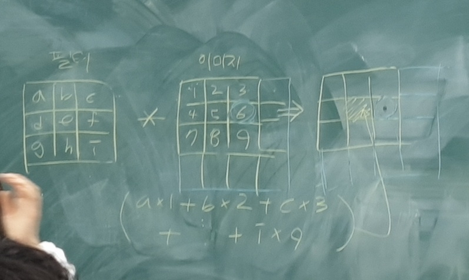
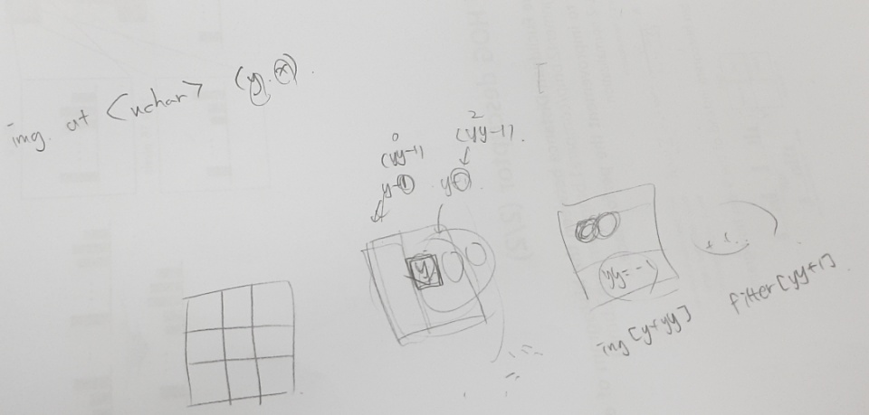
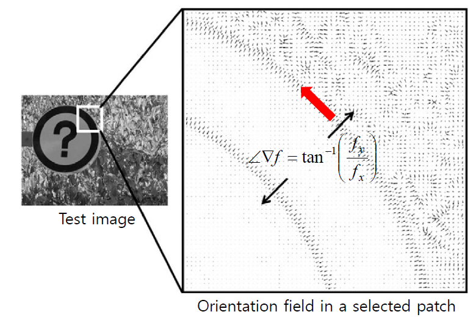

# Review

	-date: 2019.01.15(Tue) 14:00~17:00
	-location:건국대학교 신공학관 1203호

## 수업 목표

	엣지 검출
	엣지 히스토그램 만들기


### 수업 내용
	Image edge
		edge:색상이 바뀌는 가장자리 부분
		필터를 씌워서 edge를 쉽게 구할 수 있다.

		edge 구하는 방법: matrix로 구하고 있어서 불연속적인 자료 사용
		x방향에서는 x방향대로 y방향에서는 y방향대로 계산을 해준다
		
		edge magnitude 구하기: fx_val, fy_val을 제곱해서 각각 더해서 sqrt시킨다.

		min max:
			int data[300]=[0,1,...]
			int min = 1000000000000
			int max = -1

			for(j=0;j<300;j++){
				min = (data[j]<min)? data[j]:min;
				max = (data[j]>max)? data[j]:max;
			}

		Normalization:
			Mat edgeMap(height, width, CV_8UC1)
			for(y...)
				for(x...)
			edgeMap.at<uchar>(y,x)=(mag[y][x]-min)/(val-min)*255

		destroyallwindows - 다른 창을 다 지워준다.	

		코드 짤 때 동적할당으로 -> 배열과 같이 됨


```c
#include <opencv2/opencv.hpp>
#include <opencv2/highgui.hpp>
#include <opencv2/imgproc.hpp>
#include <iostream>
#include <stdio.h>
#include <math.h>

using namespace cv;
using namespace std;

int main() {
	Mat img = imread("cv1.jpg", 0); //이미지를 불러오기

	int height = img.rows;
	int width = img.cols;

	float filX[3][3] = { {-1, -1, -1},{0, 0, 0},{1, 1, 1} };//filter x 정의
	float filY[3][3] = { {-1, 0, 1},{-1, 0, 1},{-1, 0, 1} };//filter y 정의
	float *mag = (float *)calloc(height*width, sizeof(float));//동적할당으로 magnitude 지정하기, calloc을 쓰면 각 칸에 0을 넣어준다.

	for (int y = 0; y < height; y++) {
		for (int x = 0; x < width; x++) {
			float fx_val = 0;
			float fy_val = 0;
			for (int yy = 0; yy < 3; yy++) {
				for (int xx = 0; xx < 3; xx++) {
					fx_val += img.at<uchar>(y + yy - 1, x + xx - 1)* filX[yy][xx];
					fy_val += img.at<uchar>(y + yy - 1, x + xx - 1) * filY[yy][xx];
					/*img에 대해서 가로x, 세로y, 3x3 이미지에서 가운데 합성곱으로 구할 때 가운데 칸을 yy혹은 xx로 계산 */
				}
				mag[y*width + x] = sqrt(fx_val*fx_val + fy_val * fy_val);
				//y*width + x를 이유는 행렬을 1차원으로 만들어주기 위해서.- 계산에 용이하다. 예를 들어 3x5 자리를 15칸으로 만들어 버리는 것
			}
		}
	}
	float min = 100000000;
	float max = -1; // max는 최소로 잡고 min은 최대로 잡아야 한다. 그래서 비교

	for (int j = 0; j < height*width; j++) {
		min = (mag[j] < min) ? mag[j] : min;
		max = (mag[j] > max) ? mag[j] : max;
	} //mag 최대 최소 구하기

	Mat edgeMap(height, width, CV_8UC1); // 새로 edgeMap 이미지 만들어주기
	
	/*mag배열을 0~255에 맞춰서 다시 계산하고 넣기*/
	for (int y = 0; y < height; y++) {
		for (int x = 0; x < width; x++) {
			edgeMap.at<uchar>(y, x) = 255 / (max - min)*(mag[y *width + x] - min);
		}
	}
		imshow("Gray", img);
		imshow("edge", edgeMap);

		waitKey(0);

		free(magnitude); //동적할당 끝낼 때 사용

		return 0;
	
}
```




```c
#include <opencv2/imgproc.hpp>
#include <opencv2/highgui.hpp>
#include <iostream>

using namespace cv;
using namespace std;

#define file_store

#define PI 3.1415926535
#define HISTBIN 9

int main() {
	// Image read
	Mat imgColor = imread("lena.jpg", CV_LOAD_IMAGE_COLOR);
	int height = imgColor.rows;
	int width = imgColor.cols;
	Mat imgGray(height, width, CV_8UC1);
	Mat imgEdge(height, width, CV_8UC1);

	float *magnitude = (float *)calloc(height*width, sizeof(float));
	float *phase = (float *)calloc(height*width, sizeof(float));
	float *hist = (float *)calloc(HISTBIN, sizeof(float));
	int kernelx[3][3] = {
		{ -1,0,1 },
		{ -1,0,1 },
		{ -1,0,1 }
	};
	int kernely[3][3] = {
		{ -1,-1,-1 },
		{ 0,0,0 }, 
		{ 1,1,1 }
	};

	// RGB to Gray
	for (int y = 0; y < height; y++) {
		for (int x = 0; x < width; x++) {
			uchar b = imgColor.at<Vec3b>(y, x)[0];
			uchar g = imgColor.at<Vec3b>(y, x)[1];
			uchar r = imgColor.at<Vec3b>(y, x)[2];
			uchar gray = (b + g + r) / 3;
			imgGray.at<uchar>(y, x) = gray;
		}
	}

	// Get edge information
	float max = -1;
	float min = 100000;
	for (int y = 0; y < height; y++) {
		for (int x = 0; x < width; x++) {
			// Set range
			// yy : -1 ~ 1, xx : -1 ~ 1
			int start_x = (x == 0) ? 0 : -1;		// starting index (x axis)
			int end_x = (x == width - 1) ? 0 : 1;	// ending index (x axis)
			int start_y = (y == 0) ? 0 : -1;		// starting index (y axis)
			int end_y = (y == height - 1) ? 0 : 1;	// ending index (y axis)

			float fx = 0;
			float fy = 0;
			for (int yy = start_y; yy <= end_y; yy++) {
				for (int xx = start_x; xx <= end_x; xx++) {
					fx += kernelx[yy + 1][xx + 1] * imgGray.at<uchar>(y + yy, x + xx);
					fy += kernely[yy + 1][xx + 1] * imgGray.at<uchar>(y + yy, x + xx);
				}
			}
			// Calculate magnitude
			float magVal = sqrt(fx*fx + fy * fy);

			// Get min/max for normalization
			min = (magVal < min) ? magVal : min;
			max = (magVal > max) ? magVal : max;

			magnitude[y*width + x] = magVal;

			// Caculate phase (0 ~ 180)
			float phaseVal = atan2(fy, fx) * 180 / PI;
			if (phaseVal < 0)		phaseVal += 180;
			if (phaseVal >= 180)	phaseVal = 0;

			phase[y*width + x] = phaseVal;
		}
	}

	// Normalize magnitude
	for (int y = 0; y < height; y++) {
		for (int x = 0; x < width; x++) {
			float val = (magnitude[y*width + x] - min) / (max - min) * 255;
			imgEdge.at<uchar>(y, x) = (uchar)val;
		}
	}

	// Get histogram
	int interval = 180 / HISTBIN;
	for (int y = 0; y < height; y++) {
		for (int x = 0; x < width; x++) {
			int idx = phase[y*width + x] / interval;
			hist[idx]++;
		}
	}
	
#ifdef file_store
	// Save histogram as excel file
	FILE *fp;
	fp = fopen("histogram.csv", "w");
	for (int i = 0; i < 9; i++) {
		fprintf(fp, "%f\n", hist[i]);
	}
	fclose(fp);
#endif

	// Display results
	imshow("original", imgColor);
	imshow("gray", imgGray);
	imshow("edge", imgEdge);
	waitKey(0);

	destroyAllWindows();
	free(magnitude);
	free(phase);
	free(hist);

	return 0;
}
```

